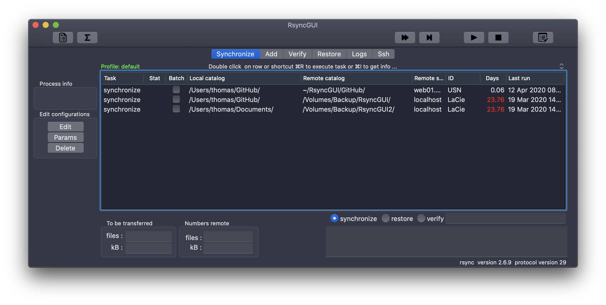
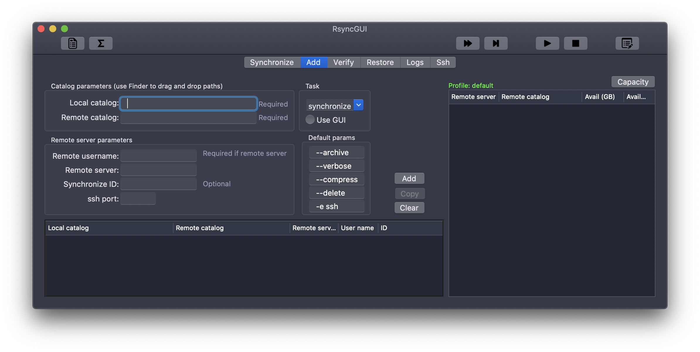
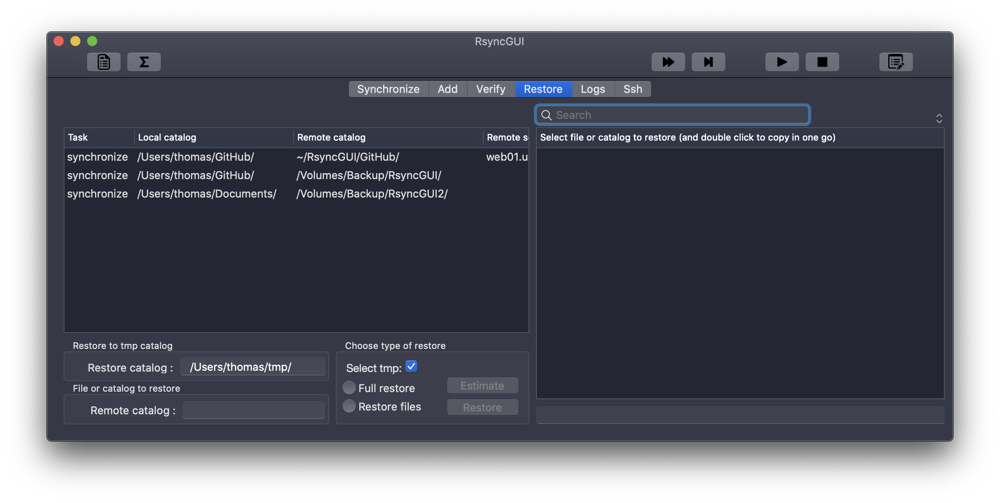
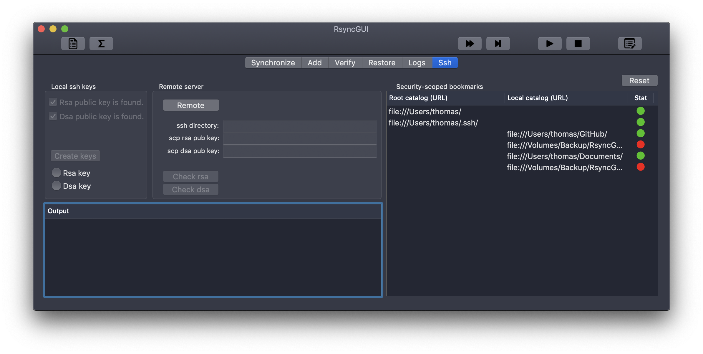

## RsyncGUI

This repository is updated for Xcode 10.2 and Swift 5. Both are still in beta and yet not released by Apple. The branch "v1.0.0-fixes" is for updating fixes to the released version of RsyncOSX if the upcoming release of Xcode 10.2 and Swift 5 takes some time.

This repository is the source code for the macOS app RsyncGUI. RsyncGUI is a sandboxed macOS app compiled with support for macOS El Capitan version 10.11 - macOS Mojave version 10.14. The application is implemented in **Swift 5** by using Xcode 10. RsyncGUI is not depended upon any third party binary distributions. There is, however, one third party source code included to check for TCP connections. The check is for informal use only and can be removed.

Rsync is a file-based synchronization and backup tool. There is no custom solution for the backup archive. You can quit utilizing RsyncGUI (and rsync) at any time and still have access to all synchronized files.

The app is [released](https://itunes.apple.com/us/app/rsyncgui/id1449707783?l=nb&ls=1&mt=12) on Apple Mac App Store as version 1.0.0 of `RsyncGUI` 24 January 2019.

### Apple App Sandboxing technology

Apple has the [App Sandboxing technology](https://developer.apple.com/app-sandboxing/) for protecting the user for malicious software. To release a macOS app on Apple Mac App Store require the app to execute inside a sandbox. This repository is a fork of RsyncOSX to enable RsyncGUI to execute inside a sandbox to be released on the Mac App Store. The name of the app is due to Apple naming conventions for apps released on the Mac App Store.

Much of the work on sandbox is based upon [Sandbox code](https://github.com/regexident/Sandbox). The user has to allow the app to read all catalogs and if remote servers is utilized rsync must be allowed to read the private ssh certificates.

### --delete parameter

**Caution** about RsyncGUI and the `--delete` parameter. The `--delete` is a [default parameter](https://rsyncosx.github.io/RsyncParameters). The parameter instructs rsync to **delete** all files in the destination which are not present in the source. Every time you add a new task to RsyncGUI, execute an estimation run (`--dry-run` parameter) and inspect the result before executing a real run. If you by accident set an empty catalog as source RsyncGUI will delete all files in the destination. To save deleted and changes files utilize the `--backup` [feature](https://rsyncosx.github.io/Parameters).

The [snapshot](https://rsyncosx.github.io/Snapshots) feature is not available in this version. If you want the snapshot feature please use RsyncOSX.

### Main view

Some views of the beta of RsyncGUI. The last view shows which catalogs is approved for access. The first line is the `.ssh` catalog because `rsync` has to read the private ssh certificates. The second row is the Documents catalog. The remote catalog is remote and not required for RsyncGUI to know about regarding the Sandbox.

### Application icon

The application icon is created by [Zsolt Sándor](https://github.com/graphis). All rights reserved to Zsolt Sándor.

### Changelog

The [Changelog](https://rsyncosx.github.io/RsyncGUIChangelog).

### Compile

To compile the code, install Xcode and open the RsyncGUI project file. Before compiling, open in Xcode the `RsyncGUI/General` preference page (after opening the RsyncGUI project file) and replace your own credentials in `Signing`, or disable Signing.
